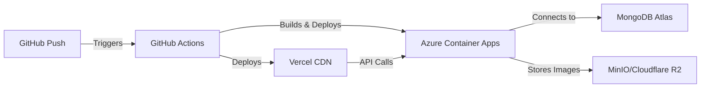

<p align="center">
  <h1 align="center">📰 News Portal</h1>
</p>

<p align="center">
  <strong>Modern full-stack news platform built with Clean Architecture</strong>
</p>

<p align="center">
  <a href="https://dotnet.microsoft.com/"></a>
  <a href="https://nextjs.org/"></a>
  <a href="https://www.mongodb.com/"></a>
  <a href="https://www.docker.com/"></a>
  <a href="tests/"></a>
  <a href="LICENSE"></a>
</p>

<p align="center">
  <a href="#-quick-start">Quick Start</a> •
  <a href="#-key-features">Features</a> •
  <a href="#-documentation">Documentation</a> •
  <a href="#-api-endpoints">API</a> •
  <a href="#-deployment">Deployment</a>
</p>

---

## 🚀 Quick Start

> **Prerequisites**: Docker Desktop installed and running

```bash
# Clone the repository
git clone https://github.com/bkalafat/newsportal.git
cd newsportal

# Create environment file (optional)
cp .env.example .env

# Start all services with Docker Compose
docker compose up -d

# Verify services are running
docker compose ps
```

### 🌐 Access Your Services

| Service | URL | Credentials |
|---------|-----|-------------|
| **🔥 Backend API** | http://localhost:5000 | - |
| **📚 Swagger UI** | http://localhost:5000/swagger | - |
| **🗄️ MongoDB Admin** | http://localhost:8081 | `admin` / `admin123` |
| **📦 MinIO Console** | http://localhost:9001 | `minioadmin` / `minioadmin123` |
| **🎨 Frontend** | http://localhost:3000 | - |

**Test the API:**
```bash
curl http://localhost:5000/health
# Response: {"status":"Healthy","mongodb":"Connected"}
```

## ✨ Key Features

<table>
<tr>
<td width="50%">

### 🏗️ Architecture
- **Clean Architecture** with SOLID principles
- **Domain-Driven Design** with clear layer separation
- **Dependency Injection** throughout
- **Repository Pattern** for data access

### 🔒 Security & Performance
- **JWT Authentication** with Bearer tokens
- **FluentValidation** for all inputs
- **Memory Caching** (30-60 min TTL)
- **Auto-Scaling** (0-10 replicas)

</td>
<td width="50%">

### 🚀 Technology
- **ASP.NET Core 9** with C# 13+
- **MongoDB 7.0** with optimized indexes
- **MinIO** S3-compatible storage
- **Next.js 16** with TypeScript

### 🧪 Quality Assurance
- **178+ Tests** (unit + integration)
- **CI/CD** with GitHub Actions
- **Health Checks** for all services
- **Swagger/OpenAPI** documentation

</td>
</tr>
</table>

## 📁 Project Structure

```
newsportal/
├── backend/                 # .NET 9 Backend API
│   ├── Domain/             # Core business entities (News, ImageMetadata)
│   ├── Application/        # Business logic, services, DTOs, validators
│   ├── Infrastructure/     # MongoDB, MinIO, JWT, caching
│   ├── Presentation/       # Controllers, middleware, extensions
│   └── Common/             # Shared utilities (SlugHelper for Turkish)
├── frontend/               # Next.js 16 Frontend
│   ├── app/               # App Router pages
│   ├── components/        # React components (Shadcn/ui)
│   └── lib/               # API client, utilities, hooks
├── tests/                 # Test suite (178+ tests)
│   ├── Unit/             # Service, validator, DTO tests
│   └── Integration/      # Controller, repository tests
├── docs/                 # Documentation
│   ├── BUILD.md         # Build instructions
│   ├── RUN.md           # Running locally & development
│   ├── DEPLOY.md        # Production deployment guide
│   └── ARCHITECTURE.md  # Architecture & design patterns
├── .github/              # GitHub Actions workflows
└── docker-compose.yml   # Docker orchestration
```

## 📖 Documentation

| Document | Description |
|----------|-------------|
| **[BUILD.md](docs/BUILD.md)** | How to build the project (Docker & local) |
| **[RUN.md](docs/RUN.md)** | Running & development guide |
| **[DEPLOY.md](docs/DEPLOY.md)** | Production deployment instructions |
| **[ARCHITECTURE.md](docs/ARCHITECTURE.md)** | System architecture & design patterns |
| **[Frontend README](frontend/README.md)** | Next.js frontend documentation |
| **[Azure README](azure/README.md)** | Azure deployment details |

## 🔧 Development

### Run Tests

```bash
# All tests (178+)
dotnet test newsApi.sln

# Unit tests only
dotnet test --filter "FullyQualifiedName~Unit"

# Integration tests only
dotnet test --filter "FullyQualifiedName~Integration"
```

### Docker Helper Scripts (Windows)

```powershell
.\docker-start.ps1     # Start all services
.\docker-stop.ps1      # Stop all services
.\docker-logs.ps1      # View logs
.\docker-status.ps1    # Check container status
.\docker-rebuild.ps1   # Rebuild and restart
```

### Hot Reload Development

```bash
# Backend (watches for code changes)
cd backend
dotnet watch run

# Frontend (Next.js dev server)
cd frontend
npm run dev
```

## 🌐 API Endpoints

| Method | Endpoint | Description | Auth |
|--------|----------|-------------|------|
| GET | `/api/news` | List all news articles | No |
| GET | `/api/news/{id}` | Get article by ID | No |
| GET | `/api/news/by-url?url={slug}` | Get article by slug | No |
| POST | `/api/news` | Create new article | ✅ JWT |
| PUT | `/api/news/{id}` | Update article | ✅ JWT |
| DELETE | `/api/news/{id}` | Delete article | ✅ JWT |
| POST | `/api/news/upload-image` | Upload image | ✅ JWT |
| POST | `/api/auth/login` | Get JWT token | No |
| GET | `/health` | Health check | No |

**Interactive API docs**: http://localhost:5000/swagger

## 🚢 Deployment

### Production Architecture



### Production Stack

| Component | Platform | Auto-Deploy | Scaling |
|-----------|----------|-------------|---------|
| **Backend API** | Azure Container Apps | ✅ GitHub Actions | 0-10 replicas |
| **Frontend** | Vercel | ✅ Git Push | Global CDN |
| **Database** | MongoDB Atlas | Manual | M0 Free Tier |
| **Storage** | MinIO / Cloudflare R2 | Manual | 10GB Free |

### Deploy Commands

```bash
# Deploy backend to Azure
.\deploy-to-azure.ps1

# Frontend deploys automatically on push to master
git push origin master
```

📘 **Complete Guide**: See [DEPLOY.md](docs/DEPLOY.md) for detailed deployment instructions

## 🛠️ Tech Stack

<div align="center">

### Backend


### Frontend


### Infrastructure & DevOps


### Testing


</div>

## 📋 Prerequisites

- **Docker Desktop** (recommended) OR
- **.NET 9 SDK** + **MongoDB** + **Node.js 18+**

## 🤝 Contributing

Contributions are welcome! Please follow these guidelines:

<details>
<summary><b>Contribution Workflow</b></summary>

1. **Fork** the repository
2. **Create** your feature branch
   ```bash
   git checkout -b feature/amazing-feature
   ```
3. **Commit** your changes
   ```bash
   git commit -m 'Add amazing feature'
   ```
4. **Push** to the branch
   ```bash
   git push origin feature/amazing-feature
   ```
5. **Open** a Pull Request

### ✅ Before Submitting

- [ ] All tests pass (`dotnet test`)
- [ ] Code follows Clean Architecture principles
- [ ] Documentation is updated
- [ ] No breaking changes (or clearly documented)

</details>

See [CONTRIBUTING.md](CONTRIBUTING.md) for more details.

## 📄 License

This project is licensed under the **MIT License** - see the [LICENSE](LICENSE) file for details.

## 📞 Support & Community

<p align="center">
  <a href="https://github.com/bkalafat/newsportal/issues">
    
  </a>
  <a href="https://github.com/bkalafat/newsportal/stargazers">
    
  </a>
  <a href="https://github.com/bkalafat/newsportal/network/members">
    
  </a>
</p>

<p align="center">
  <strong>Need help?</strong> Open an <a href="https://github.com/bkalafat/newsportal/issues">issue</a> or start a <a href="https://github.com/bkalafat/newsportal/discussions">discussion</a>
</p>

---

<p align="center">
  <strong>Built with ❤️ using Clean Architecture principles</strong>
</p>

<p align="center">
  <sub>⭐ Star this repository if you find it helpful!</sub>
</p>
